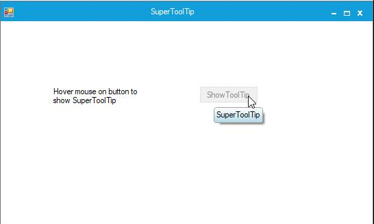

# How to Display WinForms SuperToolTip for Disabled Control
This example demonstrates how to display a Syncfusion WinForms SuperToolTip for a disabled control. By default, tooltips do not appear for disabled controls in Windows Forms applications. However, there are scenarios where you may want to provide additional information or guidance even when the control is not active. This is especially useful in complex forms where certain fields are disabled based on conditions, and you want to explain why they are disabled or what needs to be done to enable them.

The SuperToolTip control from Syncfusion offers advanced tooltip features such as rich text formatting, images, and custom layouts, making it ideal for delivering detailed information.

## Why This Is Useful
- Improved UX: Helps users understand why a control is disabled.
- Guidance: Provides instructions on how to enable the control.
- Rich Content: Supports formatted text and images for better clarity.

## Implementation Overview
- Initialize the SuperToolTip component.
- Handle the MouseMove event of the form.
- Detect when the mouse hovers over the disabled control.
- Display the SuperToolTip at a specified location.

## Example Code
### Designer Code

```C#
private void InitializeComponent()
{
    this.components = new System.ComponentModel.Container();
    this.buttonAdv1 = new Syncfusion.Windows.Forms.ButtonAdv();
    this.label1 = new System.Windows.Forms.Label();
    this.SuspendLayout();

    // buttonAdv1
    this.buttonAdv1.Appearance = Syncfusion.Windows.Forms.ButtonAppearance.Office2016DarkGray;
    this.buttonAdv1.BeforeTouchSize = new System.Drawing.Size(84, 23);
    this.buttonAdv1.Enabled = false;
    this.buttonAdv1.ForeColor = System.Drawing.SystemColors.ControlLightLight;
    this.buttonAdv1.Location = new System.Drawing.Point(286, 96);
    this.buttonAdv1.Name = "buttonAdv1";
    this.buttonAdv1.Size = new System.Drawing.Size(84, 23);
    this.buttonAdv1.Text = "ShowToolTip";

    // label1
    this.label1.Location = new System.Drawing.Point(69, 96);
    this.label1.Size = new System.Drawing.Size(135, 32);
    this.label1.Text = "Hover mouse on button to show SuperToolTip";

    // Form1
    this.ClientSize = new System.Drawing.Size(533, 292);
    this.Controls.Add(this.label1);
    this.Controls.Add(this.buttonAdv1);
    this.MouseMove += new System.Windows.Forms.MouseEventHandler(this.Form1_MouseMove);
    this.ResumeLayout(false);
}
```

### Logic to Show SuperToolTip

```C#
private SuperToolTip superToolTip1;
bool IsShown = false;

public Form1()
{
    InitializeComponent();
    superToolTip1 = new SuperToolTip();
}

private void Form1_MouseMove(object sender, MouseEventArgs e)
{
    Control ctrl = this.GetChildAtPoint(e.Location);
    if (ctrl != null)
    {
        if (ctrl == this.buttonAdv1 && !IsShown)
        {
            ToolTipInfo tooltip = new ToolTipInfo();
            tooltip.Body.Text = "SuperToolTip";

            this.superToolTip1.SetToolTip(this.buttonAdv1, tooltip);
            Point pt1 = new Point(ctrl.Location.X + 20, ctrl.Location.Y + 30);

            this.superToolTip1.Show(tooltip, this.PointToScreen(pt1), 1000);
            IsShown = true;
        }
    }
    else
    {
        this.superToolTip1.Hide();
        IsShown = false;
    }
}
```

## Output


